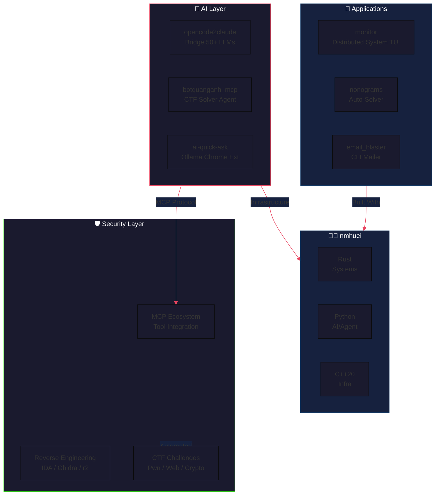
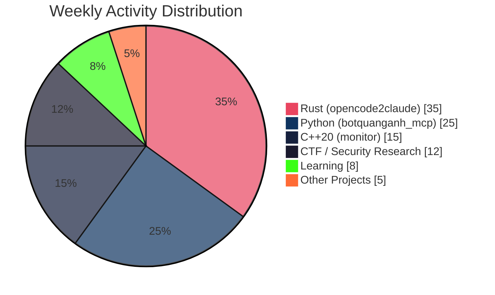

# 👋 Xin chào, I'm Huei

---

### 🧠 System Architecture

---

## ⚡ About Me

> *"Decrypting complexity, automating the future."*

  <table>
    <tr>
      <td align="center">📍 <b>Location</b></td>
      <td>Cầu Giấy, Hà Nội, Vietnam</td>
      <td align="center">🎯 <b>Focus</b></td>
      <td><b>AI & Cyber Security</b> intersection</td>
    </tr>
    <tr>
      <td align="center">🌱 <b>Philosophy</b></td>
      <td colspan="3">"Learning by shipping" — building real things to master complex systems</td>
    </tr>
    <tr>
      <td align="center">🔧 <b>Stack</b></td>
      <td colspan="3">
        
        
        
        
        
      </td>
    </tr>
  </table>

---

## 🚀 Featured Projects

### AI & Cyber Security (MCP Tools)

<table>
  <tr>
    <td width="33%" valign="top">
      <h3 align="center">
        <a href="https://github.com/nmhuei/botquanganh_mcp">
           
          🛡️ MCP CTF Solver
        </a>
      </h3>
      

        An advanced MCP server enabling AI agents to autonomously solve CTF challenges (pwn/web).  
        
        
        
      

    </td>
    <td width="34%" valign="top">
      <h3 align="center">
        <a href="https://github.com/nmhuei/chatCLI">
           
          💬 Decentralized Chat TUI
        </a>
      </h3>
      

        A decentralized terminal chat client in <b>Rust</b> with end-to-end encryption (DH + AES-256-GCM), UPnP port forwarding, and MCP integration.  
        
        
        
      

    </td>
    <td width="33%" valign="top">
      <h3 align="center">
        <a href="https://github.com/nmhuei/opencode2claude">
           
          🌉 LLM Bridge
        </a>
      </h3>
      

        Use Claude Code with <b>50+ LLMs</b>. Features WARP proxy pool, token estimation, casing resolution. Single ~5MB binary.  
        
        
        
      

    </td>
  </tr>
</table>

### Infrastructure & Automation

<table>
  <tr>
    <td width="50%" valign="top">
      <h3 align="center">
        <a href="https://github.com/nmhuei/monitor">
          🖥️ <b>Distributed System Monitor</b>
        </a>
      </h3>
      

        <b>C++20</b> distributed monitoring platform with ncursesw TUI, Prometheus integration, and real-time CPU/RAM/Disk/Network metrics.  
        
        
        
      

    </td>
    <td width="50%" valign="top">
      <h3 align="center">
        <a href="https://github.com/nmhuei/ai-quick-ask">
          🤖 <b>AI Quick Ask</b>
        </a>
      </h3>
      

        Chrome extension for querying local <b>Ollama</b> LLMs instantly via text highlight + hotkeys.  
        
        
        
      </b>
    </td>
  </tr>
  <tr>
    <td width="50%" valign="top">
      <h3 align="center">
        <a href="https://github.com/nmhuei/email_blaster">
          📧 <b>Email Blaster</b>
        </a>
      </h3>
      

        Automated CLI batch email sender using SendGrid API with template injection, rate limiting, and dry-run safety.  
        
        
      

    </td>
    <td width="50%" valign="top">
      <h3 align="center">
        <a href="https://github.com/nmhuei/nonograms">
          🧩 <b>Nonograms Solver</b>
        </a>
      </h3>
      

        Auto-solver for nonograms.org puzzles. Rust solver + Python automation + Chrome extension for in-browser solving.  
        
        
        
      

    </td>
  </tr>
</table>

---

## 📊 GitHub Analytics

  <table>
    <tr>
      <td>
        
      </td>
      <td>
        
      </td>
    </tr>
  </table>
  

---

## 🛠️ Tech Arsenal

### Languages & Runtimes

### Frameworks & Libraries

### Infrastructure & Tools

### Security Arsenal

---

## 📈 Current Focus

---

## 🐍 Contribution Graph

  <picture>
    <source media="(prefers-color-scheme: dark)" srcset="https://raw.githubusercontent.com/nmhuei/nmhuei/output/github-contribution-grid-snake-dark.svg">
    <source media="(prefers-color-scheme: light)" srcset="https://raw.githubusercontent.com/nmhuei/nmhuei/output/github-contribution-grid-snake.svg">
    
  </picture>

---

## 🤝 Connect

  
  
  

  
  **Thanks for stopping by** ⭐
  
  *If any of my projects helped you, consider starring them — it helps others discover them too!*
  

